# HR Analytics Dashboard: Employee Attrition & Workforce Insights

## Project Overview

This project analyzes employee data to uncover key workforce trends, attrition patterns, employee demographics, and job satisfaction metrics. Using SQL, Excel, and Tableau, the dashboard provides actionable insights that can help HR teams improve employee retention and workforce planning.

The project covers employee demographics, attrition analysis, income distribution, overtime impact, work-life balance, job satisfaction, and marital status analysis.

## Project Objective

To analyze employee attrition patterns and workforce demographics using SQL and Tableau, enabling HR teams to identify key factors affecting employee retention and support data-driven decision-making.

---

## Tools & Technologies

- MySQL Workbench
- Tableau Public
- Microsoft Excel
- SQL

---

## Dataset

The project uses the IBM HR Analytics Employee Attrition dataset containing employee demographic, job-related, and performance information.

### Key Features

### Employee Overview

- Total Employees
- Gender Distribution
- Marital Status Distribution
- Age Group Analysis
- Experience Group Distribution

### Attrition Analysis

- Overall Attrition Rate
- Attrition by Department
- Attrition by Job Role
- Overtime vs Attrition
- Work-Life Balance vs Attrition
- Job Satisfaction vs Attrition

### Compensation Analysis

- Average Monthly Income by Department

---

## Data Analysis

SQL queries were used to calculate key HR metrics, analyze employee attrition patterns, evaluate workforce demographics, and generate business insights for decision-making.

## Dataset Information

- Source: IBM HR Analytics Employee Attrition Dataset
- Total Records: 1,470 Employees
- Features: 35 Columns
- Domain: Human Resources Analytics

---

## 📈 Dashboard Features

### KPI Cards

- Total Employees
- Employees Left
- Attrition Rate (%)
- Average Monthly Income

### Visualizations

- Attrition by Department
- Attrition by Job Role
- Gender Distribution
- Marital Status Distribution
- Age Group Analysis
- Experience Group Distribution
- Overtime vs Attrition
- Job Satisfaction vs Attrition
- Work-Life Balance vs Attrition

### Interactive Insights

- Workforce Demographics
- Employee Retention Trends
- Department-wise Analysis
- Employee Satisfaction Analysis

### Interactive Filters

- Department
- Job Role
- Gender
- Age Group
- Overtime

---

## Key Insights

- Research & Development has the highest attrition count.

- Employees working overtime show higher attrition.

- Most employees belong to the 26–35 age group.

- Attrition is highest among Laboratory Technicians.

- Employees with lower work-life balance exhibit significantly higher attrition rates, with Work-Life Balance Level 1 showing the highest attrition rate (31.25%).

---

## Project Structure

```text
HR-Analytics-Dashboard/
│
├── Dataset/
│   └── hr_analytics.csv
│
├── SQL/
│   ├── hr_data.sql
│   └── SQL_Query_Results/
│       ├── agegroupanalysis.PNG
│       ├── Attrition_by_jobrole.PNG
│       ├── avgAge.PNG
│       ├── avgexperience.PNG
│       ├── avgMonthlyIncome.PNG
│       ├── avgMonthlyIncome(departmentwise).PNG
│       ├── depart_empl_count.PNG
│       ├── exp_wise_employee_count.PNG
│       ├── JobsatisfactionVSAttrition.PNG
│       ├── genderdistribution.PNG
│       ├── maritalstausdistribution.PNG
│       ├── totalleft(depatmentise).PNG
│       ├── totalempleft.PNG
│       ├── totalemployees.PNG
│       ├── attritionrate.PNG
│       ├── overtimeVSAttrition.PNG
│       └── work_lifebalanceVsAttrition.PNG
│
├── Dashboard/
│   ├── HR_Analytics_Dashboard.PNG
│   └── Dashboard_Charts/
│       ├── AgeWiseAnalysis.PNG
│       ├── AttritionByDepartment.PNG
│       ├── AttritionByJobRole.PNG
│       ├── ExpDistribution.PNG
│       ├── GenderDistribution.PNG
│       ├── DepartmentWiseIncome.PNG
│       ├── JobSatisVSAttrition.PNG
│       ├── maritalstatus.PNG
│       ├── WorkLifeVSAttrition.PNG
│       └── OverTimeVsAttrition.PNG
├── Tableau/
│   └── HR Analytics Dashboard.twbx
│
└── README.md
```

---

## Dashboard Preview

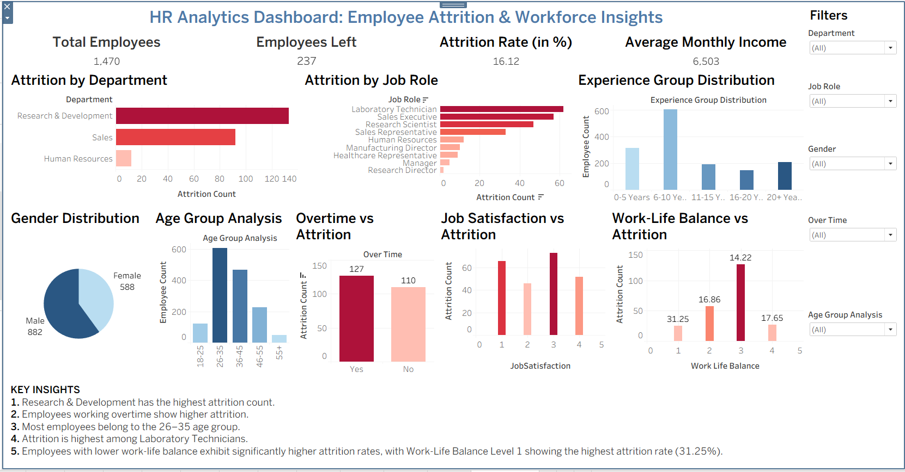

## Dashboard Charts

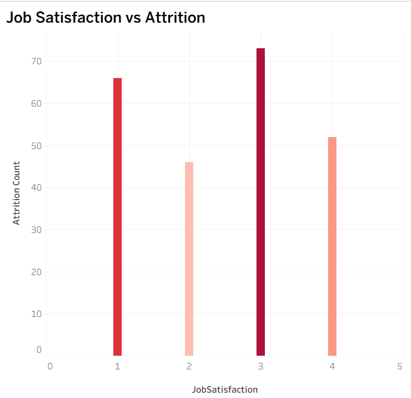
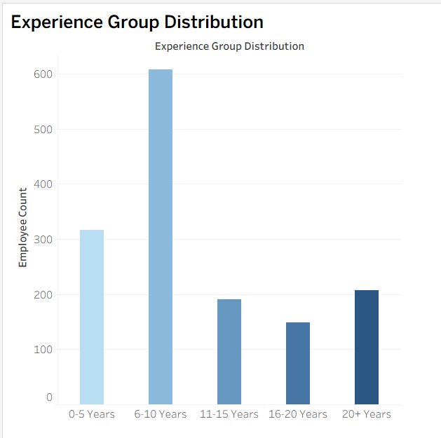
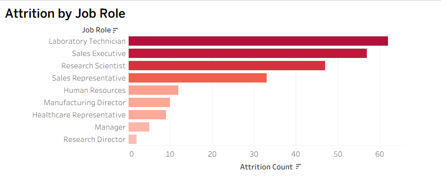
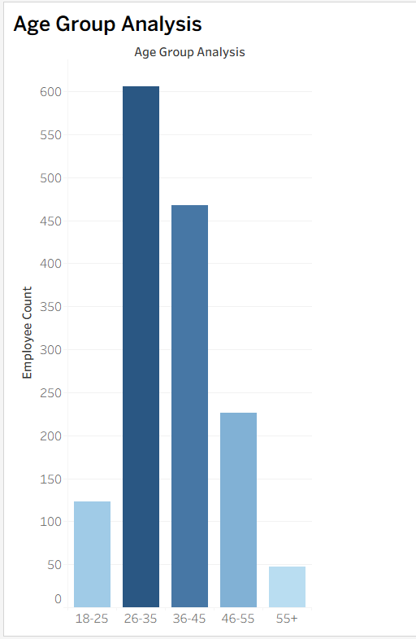
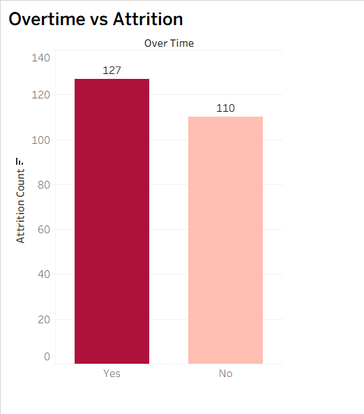
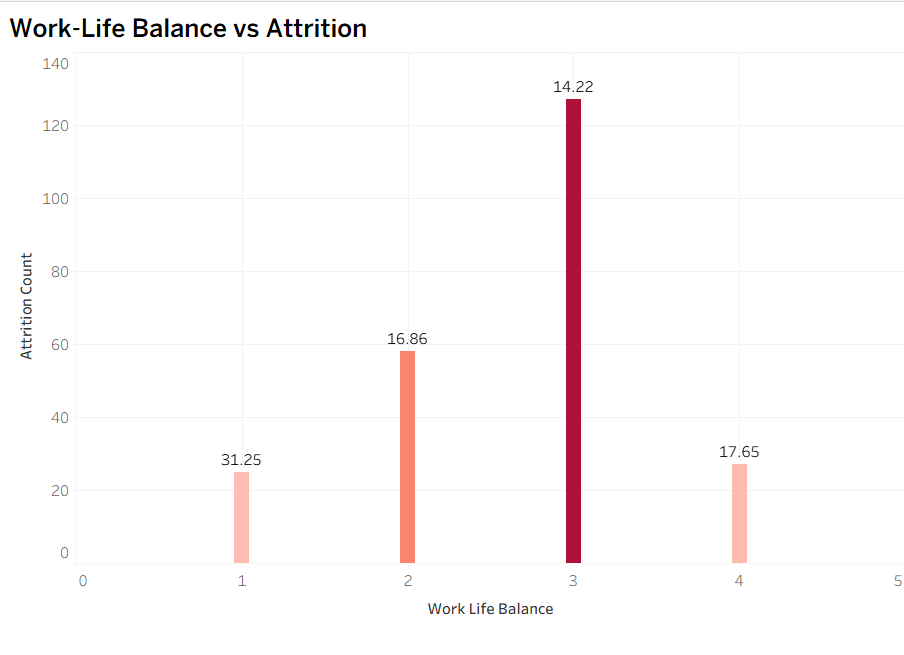

---

## SQL Queries Results

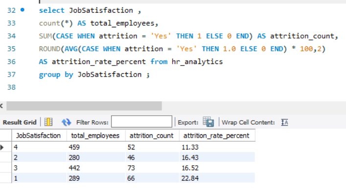
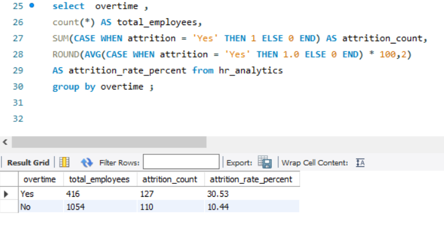
.PNG>)
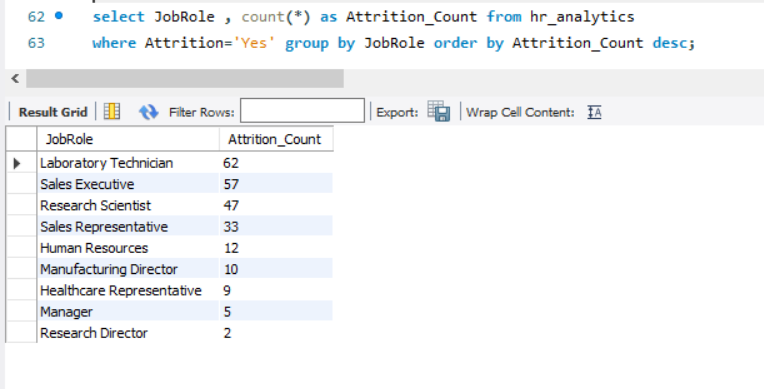
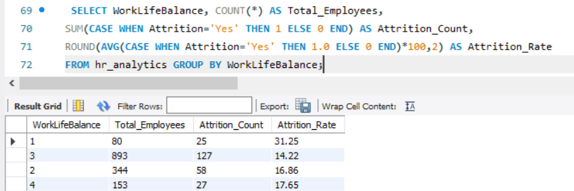

---

## Interactive Dashboard

🔗 Tableau Public Dashboard:
https://public.tableau.com/app/profile/anjali.sharma2811/vizzes

---

## Business Impact

This dashboard helps HR teams:

- Monitor employee attrition trends
- Identify high-risk employee groups
- Understand workforce demographics
- Evaluate the impact of overtime and work-life balance
- Support employee retention strategies
- Enable data-driven HR decision-making

---

## 🚀 How to Use

1. Clone this repository.
2. Open the dataset from the `Dataset` folder.
3. Run the SQL queries in MySQL Workbench.
4. Open the Tableau workbook (`.twbx`) file.
5. Explore the dashboard and insights.

---

## 🎯 Skills Demonstrated

- SQL (Aggregation, Group By, Filtering)
- Data Cleaning & Validation
- Exploratory Data Analysis (EDA)
- HR Analytics
- Tableau Dashboard Development
- Data Visualization
- KPI Design
- Business Insights & Reporting

---

## Resume Project Summary

Developed an HR Analytics Dashboard using SQL, Excel, and Tableau to analyze employee attrition, workforce demographics, compensation trends, and job satisfaction metrics. Created KPI-driven visualizations and generated actionable insights to support employee retention and workforce planning.

## Author

**Anjali Sharma**

Aspiring Data Analyst | SQL | Tableau | Excel
